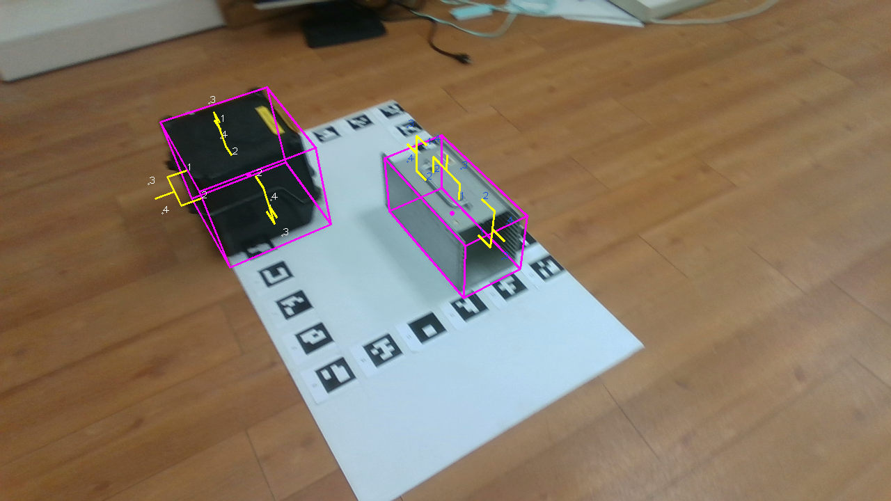
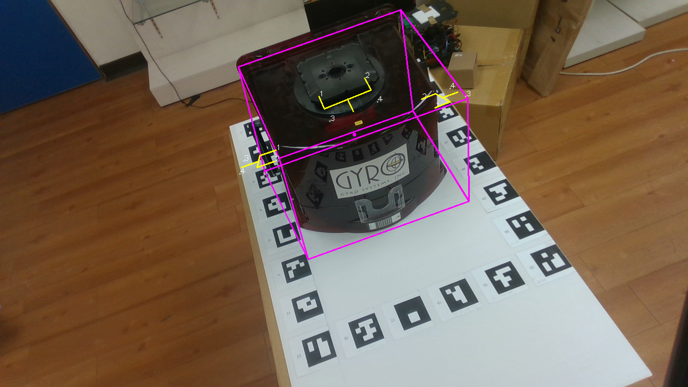

# GraspGeneration

| ||
|-|-|

mypose資料夾是本專案內容

## 1. 環境建置
本專案使用anaconda建立，環境如下：

|operating system|Python|Cuda|Pytorch|Torchvision|
|---|---|---|---|---|
|Ubuntu 22.04 LTS|3.8.19|11.5|2.2.2|0.17.2|

使用套件紀錄
> /mypose/environment.yml 

## 2. 訓練
1. 在mypose/lib 裡面創立一個data資料夾，把資料集取名叫做foup_grasp_dataset並放在data內

dataset: https://drive.google.com/drive/folders/114kB3g8UlY6eE3XzeqoLzvcGhHzyyJcy?usp=drive_link

2. 進到mypose
> cd mypose

3. 使用指令進行訓練
> python main_ctnet.py --batch_size [BATCHSIZE] --num_epochs [NUMEPOCH]

4. checkpoint會出現在以下資料夾
>/mypose/checkpoint/

## 3. demo
訓練所使用的資料集的1/5會被分出來做測試
>python demo.py --load_model [path/to/your/checkpoint]